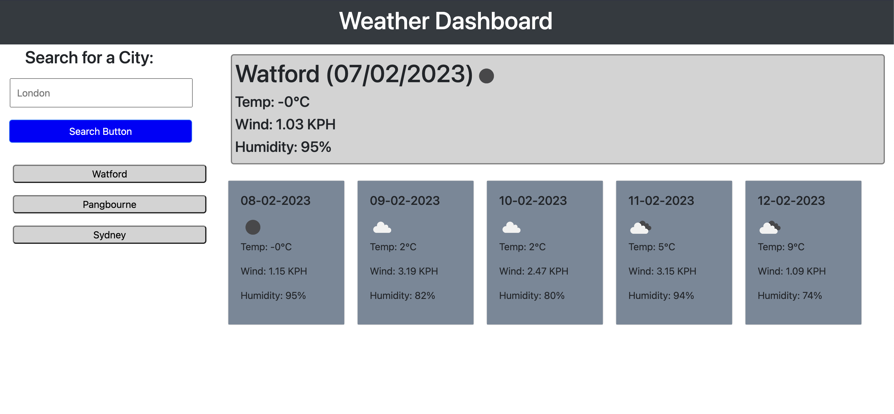

# Weather-Dashboard
A weather dashboard that allows you to search for your city and return the current weather along with a 5 day forecast.

## Description

### Purpose
The purpose of this project was to understand how to use server side APIs to return data to the user in a helpful way.

API used: OpenWeather

The task was to create an application that allows a user to search for a city, which would then return the current and future 5 day forecast: 

* When a user searches for a city they are presented with current and future conditions for that city and that city is added to the search history
* When a user views the current weather conditions for that city they are presented with the city name, date, temperature, wind speed etc.
* When a user view future weather conditions for that city they are presented with a 5-day forecast that displays key information such as date, temp, wind speed etc. 
* When a user click on a city in the search history they are again presented with CURRENT conditions for that city
* When a user click on a city in the search history they are again presented with FUTURE conditions for that city

What I could improve: 
* If I had more time for this task I would clean up the javascript and separate out more of the functions so it's more readable and more of the code was reusable.
* I would also clean up the UI a bit and maybe add a splash screen so it doesn't look so bare when first loaded.

[Project Website](https://nailahmukhtar.github.io/Weather-Dashboard).

## Usage
To view this in action, you can navigate to my [Project Website](https://nailahmukhtar.github.io/Weather-Dashboard).

## Credits
Assignment provided by © 2022 edX Boot Camps LLC

## License
Not Applicable.
